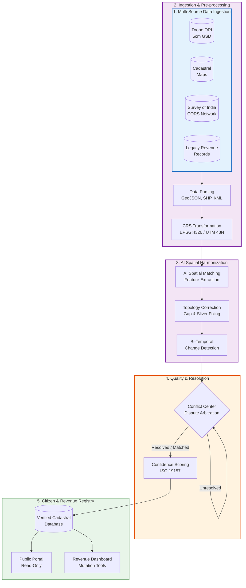

# Bhumi Sangam Architecture

This document illustrates the automated multi-source geospatial harmonization flow in the Bhumi Sangam platform.

```mermaid
flowchart TD
    %% Data Sources
    subgraph Sources [1. Multi-Source Data Ingestion]
        D1[(Drone ORI\n5cm GSD)]
        D2[(Cadastral\nMaps)]
        D3[(Survey of India\nCORS Network)]
        D4[(Legacy Revenue\nRecords)]
    end

    %% Ingestion & Normalization
    subgraph Ingestion [2. Ingestion & Pre-processing]
        I1[Data Parsing\nGeoJSON, SHP, KML]
        I2[CRS Transformation\nEPSG:4326 / UTM 43N]
        
        Sources --> I1
        I1 --> I2
    end

    %% Harmonization
    subgraph Harmonization [3. AI Spatial Harmonization]
        H1[AI Spatial Matching\nFeature Extraction]
        H2[Topology Correction\nGap & Sliver Fixing]
        H3[Bi-Temporal\nChange Detection]
        
        I2 --> H1
        H1 --> H2
        H2 --> H3
    end

    %% Resolution & Scoring
    subgraph QualityControl [4. Quality & Resolution]
        Q1{Conflict Center\nDispute Arbitration}
        Q2[Confidence Scoring\nISO 19157]
        
        H3 --> Q1
        Q1 -- "Unresolved" --> Q1
        Q1 -- "Resolved / Matched" --> Q2
    end

    %% Output
    subgraph Registry [5. Citizen & Revenue Registry]
        O1[(Verified Cadastral\nDatabase)]
        O2[Public Portal\nRead-Only]
        O3[Revenue Dashboard\nMutation Tools]
        
        Q2 --> O1
        O1 --> O2
        O1 --> O3
    end

    classDef source fill:#e3f2fd,stroke:#1565c0,stroke-width:2px;
    classDef process fill:#f3e5f5,stroke:#7b1fa2,stroke-width:2px;
    classDef decision fill:#fff3e0,stroke:#e65100,stroke-width:2px;
    classDef output fill:#e8f5e9,stroke:#2e7d32,stroke-width:2px;

    class Sources source;
    class Ingestion,Harmonization process;
    class QualityControl decision;
    class Registry output;
```
